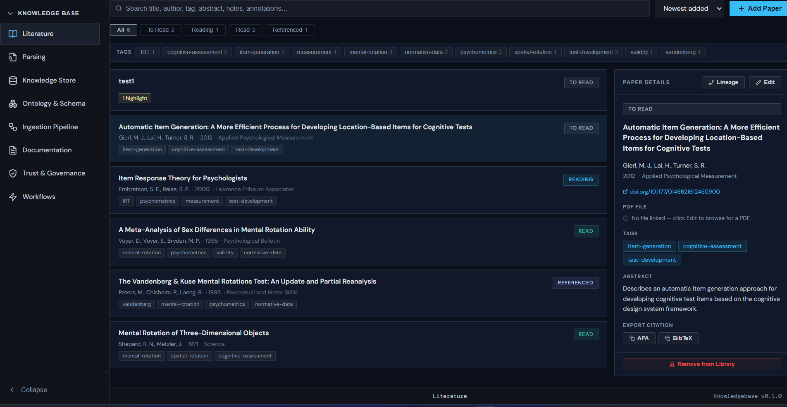
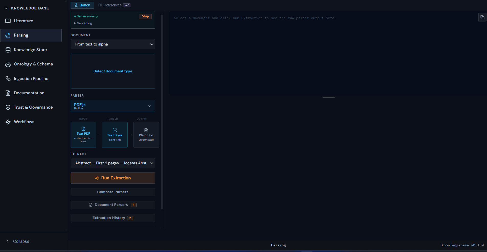
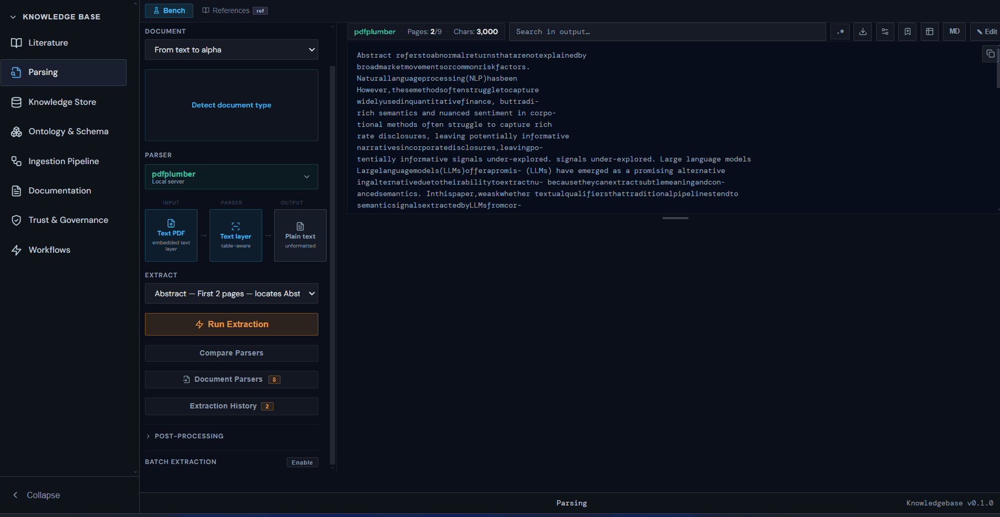

# Knowledgebase

A desktop application for building and managing formal knowledge bases. Built with **Electron + React**, it covers the full lifecycle of a KB system — from literature ingestion and document parsing through to ontology design, storage configuration, trust governance, and documentation.


---

## Author

**Ender De Freitas** — AI & Cognitive Data Scientist

[](https://github.com/endpsych/)
[](https://www.linkedin.com/in/endpsych/)

---

## Stack

- **Electron** — desktop shell, frameless window, IPC
- **React 18** — UI
- **react-pdf / PDF.js** — in-app PDF rendering
- **react-markdown** — markdown rendering
- **Python sidecar** (`scripts/pymupdf_server.py`) — local HTTP server for multi-engine document parsing
- **PyMuPDF, pdfplumber, Docling, EasyOCR, LlamaParse** — parsing backends

---

## Getting Started

### Prerequisites
- Node.js 18+
- Python 3.12+ (for the parser server)
- [uv](https://docs.astral.sh/uv/) (recommended) or pip

### Install

```bash
npm install
```

> The PDF.js worker file (`public/pdf.worker.min.mjs`) is copied automatically from `node_modules` by the `postinstall` script.

### Set up the Python environment

```bash
uv sync
# or
pip install pymupdf pdfplumber docling easyocr markitdown llama-parse
```

### Run

```bash
npm start
```

This starts the React dev server on port **3002** and launches Electron.

---

## Pages

### 📚 Literature

> **Fully implemented**

The core paper management library. A structured reading and reference tracker for the documents that feed the knowledge base.

**Features:**
- Add, edit, and delete papers with full metadata — title, authors, year, journal, DOI, URL, arXiv ID, abstract, personal notes
- **Status tracking** per paper: To Read · Reading · Read · Referenced
- **Search** across title, authors, journal, tags, abstract, notes, and annotations simultaneously
- **Tag filtering** with domain-relevant presets (psychometrics, IRT, CTT, validity, reliability, DIF, spatial-rotation, etc.)
- **Sort** by date added, publication year, or title
- **Citation export** in APA and BibTeX formats with one-click copy
- **In-app PDF reader** — opens directly from the library card

---

### 📄 PDF Reader *(embedded in Literature)*

> **Fully implemented**

A full-featured reading environment that opens when you click a paper with a linked PDF file.

**Features:**
- Continuous scroll with fit-width default, zoom controls (1×–3×), dark mode toggle
- **Reading progress bar** and last-page memory
- **Thumbnail strip** with lazy-loaded virtualization for large documents
- **Table of contents sidebar** — expandable outline tree built from PDF bookmarks
- **Text layer** enabled — text is selectable and copy-pasteable
- **Find in document** — live match highlighting with forward/backward navigation
- **Annotations panel** — 6 highlight colors (yellow, red, green, blue, purple, orange), per-highlight comments, edit and delete
- **Area selection** — drag to capture a page region as a snapshot
- **Notes editor** with markdown heading support (H1/H2/H3)
- **Inline KB capture forms** — from any highlight, directly add to the KB:
  - Claims / propositions with confidence levels
  - Definitions with term names
  - Events with actors and outcomes
  - Processes with steps, inputs, and outputs


### Adding a PDF file to the reader


---

### 🔬 Parsing

> **Fully implemented — core feature**

The document parsing workbench. Select a paper from the library, choose a parser engine, run the extraction, and inspect the output — all locally.

#### Parser Bench

- **8 parser engines** supported:
  | Parser | Type | Notes |
  |--------|------|-------|
  | PDF.js | Client-side | Built-in, zero setup, text-layer PDFs |
  | PyMuPDF | Local server | Fast, accurate text extraction |
  | pdfplumber | Local server | Table-aware extraction |
  | EasyOCR | Local server | OCR for scanned/image PDFs |
  | Docling | Local server | ML-based, outputs Markdown/JSON |
  | Markitdown | Local server | Office formats (DOCX, PPTX, XLSX) to Markdown |
  | Unstructured | Local server | Layout-aware element extraction |
  | LlamaParse | Cloud API | LlamaCloud service, requires API key |

- **Server management** — start/stop the Python parser server from within the UI; live server log visible in the panel
- **Document type detection** — samples the PDF and recommends the best parser (text-layer vs scanned vs mixed vs office format)
- **Extraction targets**: Full text, Abstract only, References only, or custom page ranges
- **Output viewer** — syntax-highlighted, line-numbered, with search (regex supported), copy, download, and in-place edit
- **Post-processing toggles** — strip headers/footers, remove hyphens, normalize whitespace, remove watermarks
- **Section detection** — auto-detects document sections with word counts, page spans, and a visual minimap
- **Compare mode** — run up to 3 parsers side-by-side on the same document
- **Extraction history** per paper

### PDF parsing


### Parsers comparison


### Segmentation Hierarchy


### Document segments 3d visualization


#### References Panel

An interactive educational reference covering the theoretical foundations of document segmentation — the parsing hierarchy (Document → Sections → Paragraphs → Sentences → Chunks → Tokens), NER tiers (rule-based, statistical, LLM), standard and domain-specific entity types, and 3D isometric visualizations of page layout and text structure.

---

### 🗄️ Ingestion Pipeline

> **Partially implemented** — pipeline configuration forms are functional; pipeline execution is planned

Configuration and monitoring panel for the KB ingestion pipeline. Documents how raw sources get transformed into structured knowledge.

**Implemented:** Chunking strategy configuration (section-aware, fixed-size, semantic, mixed), entity extraction pipeline setup (NER tool registry with add/edit/remove), pipeline readiness score, and manual extraction activity log.

**Planned:** Pipeline execution, automated scheduling, provenance tagging at ingest time, deduplication.

---

### 🗃️ Knowledge Store

> **Configuration UI implemented** — backend connections are planned

Inventory of the storage layer — what is stored, where, and in what form.

**Implemented configuration for:** Document store (filesystem, S3, GCS, Azure, MinIO), vector indexes (Chroma, Pinecone, Qdrant, FAISS, Weaviate, pgvector), metadata database (PostgreSQL, SQLite, DuckDB, MongoDB), graph entity store (Neo4j, RDF triple stores), knowledge unit type inventory, chunk strategy inventory, and metadata field schema.

**Planned:** Live connection testing, actual record counts, storage backend operations.

---

### 🔷 Ontology & Schema

> **Configuration UI implemented** — semantic validation and query execution are planned

Design and version the conceptual model of the KB — entity types, relationships, controlled vocabularies, and ontology files.

**Implemented:** Entity type CRUD with properties and status (Draft/Reviewed/Stable), relationship schema with cardinality, ontology file registry (.owl, .ttl, .rdf, .jsonld, YAML, JSON), controlled vocabulary management, domain alignment tracking (schema.org, Dublin Core, SKOS, PROV-O, FIBO, etc.), schema versioning with changelogs, and a computed readiness score.

**Planned:** Ontology file parsing and validation, SPARQL/RDF query execution, semantic inference.

---

### 📋 Documentation

> **Configuration UI implemented** — auto-scanning and coverage analysis are planned

Tracks the documentation health of the KB project.

**Implemented:** README quality checklist, API docs tool configuration (Sphinx, MkDocs, JSDoc, etc.), changelog format tracking, architecture diagram inventory (draw.io, PlantUML, Mermaid), and a 10-item KB-specific documentation checklist (schema docs, ingestion pipeline README, retrieval layer docs, governance docs, etc.).

**Planned:** Automated documentation scanning, docstring coverage analysis, doc build execution.

---

### 🛡️ Trust & Governance

> **Configuration UI implemented** — enforcement and detection are planned

Governance layer for KB content — provenance, access control, approval workflows, and contradiction management.

**Implemented:** Provenance field coverage (source file, page number, extraction date, confidence, human review flag, etc.), approval workflow state machine (Draft → In Review → Approved → Deprecated), versioning strategy selection, access control type configuration (RBAC, ABAC, DAC), confidentiality level definitions, contradiction detection method selection, and confidence scoring configuration.

**Planned:** Approval workflow enforcement, automated contradiction detection, confidence score computation.

---

### ⚡ Workflows

> **Implemented as a maturity and value guide**

A structured reference for understanding KB maturity levels and planning the path from raw documents to a queryable knowledge graph.

**Implemented:** 5-level KB maturity model (Unstructured → Indexed → Structured → Governed → Knowledge Graph), value pathway templates (e.g. "Faster Expert Answers": ingest → vector index → RAG), cross-tab navigation hints, and beginner/practitioner explanations for each stage.

**Planned:** Project progress tracking, task catalog, cost/benefit ROI analysis, pitfall detection.

---

## LlamaParse API Key

To use the LlamaParse cloud parser, click the **API Key** button that appears when LlamaParse is selected in the parser controls. The key is stored in the app's local browser storage — it is never written to disk as a file and is not included in any commits.

Get a key at [cloud.llamaindex.ai](https://cloud.llamaindex.ai) → API Keys (free tier: 1,000 pages/day).


## Knowledgebase Demos


---


## Project Structure

```
src/
├── app-shell/          # Sidebar, title bar, footer, navigation
├── contexts/           # KnowledgeBaseContext (shared papers state)
├── hooks/              # useSettings
├── pages/
│   ├── kb/             # Thin page wrappers for each sidebar item
│   └── knowledge-base/ # Tab components (LiteratureTab, PdfReader, etc.)
├── styles/             # Midnight Star design system (CSS variables)
scripts/
└── pymupdf_server.py   # Local HTTP server for document parsing
```

---

## License

MIT © [Ender De Freitas](https://github.com/endpsych/)
